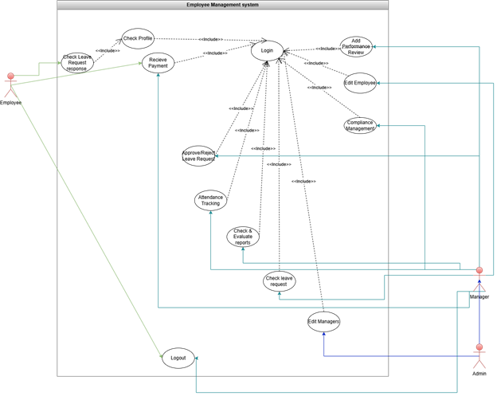
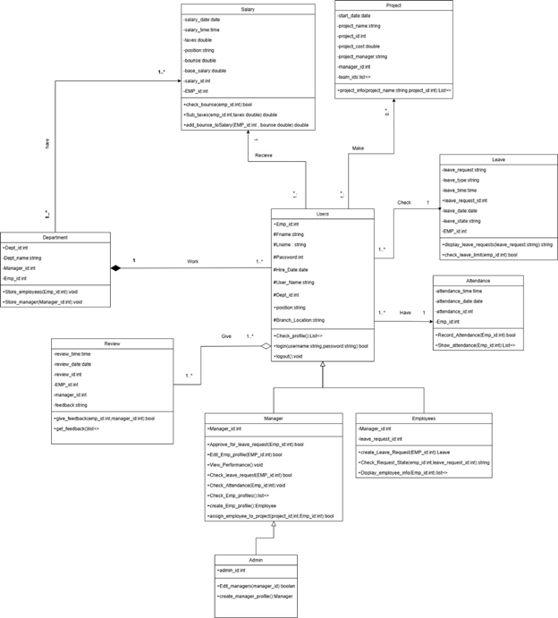
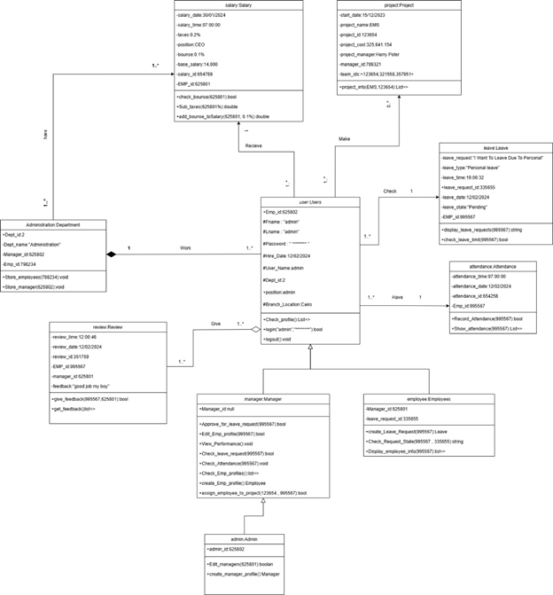

  

A progressive <a href="http://nodejs.org" target="_blank">Node.js</a> framework for building efficient and scalable server-side applications.

    

  
    
  

  <!--
  -->

## Usecase diagram

# Employee Management System (EMS)

## 📖 Overview

The **Employee Management System (EMS)** is a web-based application designed to streamline and automate HR operations within an organization. It centralizes employee data, attendance tracking, leave management, and performance evaluation into a single platform.

This system helps reduce manual work, improve accuracy, and enhance overall productivity.

---

## 🎯 Motivation

As organizations grow, traditional HR methods (manual records, spreadsheets) become inefficient and error-prone.

This project was built to:

- Automate HR processes
- Improve data accuracy
- Reduce administrative workload
- Enable data-driven decision making
- Enhance employee engagement and experience

---

## ❗ Problem Statement

Organizations face challenges such as:

- Managing employee data across multiple systems
- Inefficient attendance and leave tracking
- Lack of integration between HR processes
- High risk of errors and data loss

---

## 💡 Solution

The EMS provides a **centralized system** that:

- Manages employee records
- Tracks attendance and leave
- Handles performance reviews
- Generates reports and analytics

---

## 🚀 Features

### 🔐 Authentication & Authorization

- Secure login system
- Role-based access:
  - Admin
  - Manager
  - Employee

### 👨‍💼 Employee Management

- Add, update, delete employees
- Store personal and job information
- Assign employees to departments

### 🏢 Department Management

- Create and manage departments
- Assign employees to departments

### ⏱ Attendance Tracking

- Daily attendance recording
- Attendance reports
- Dashboard insights

### 📝 Leave Management

- Apply for leave
- Approve/reject requests
- Track leave history

### 📊 Performance Reviews

- Add performance evaluations
- Employee self-review
- Performance reports

### 📈 Reports & Analytics

- Generate HR reports
- Track employee performance and attendance trends

---

## 📦 Scope

### ✅ Included

- User authentication & role management
- Employee & department management
- Attendance tracking
- Leave management
- Performance reviews
- Basic reporting

### ❌ Excluded

- Advanced AI analytics
- Physical document management
- Conflict resolution systems
- Custom external software integrations

---

## 🧩 System Design

### 📊 Diagrams Included

- Data Flow Diagram (DFD)
- Use Case Diagram
- Activity Diagram
- Sequence Diagram
- Class Diagram
- Object Diagram
- State Diagram

---

## 🔄 Main Use Cases

- Login / Logout
- Manage Employees
- Track Attendance
- Manage Leave Requests
- Performance Reviews
- Generate Reports

---

## 🌍 Real-World Systems Inspiration

This project is inspired by:

- Workday HR System
- SAP SuccessFactors
- Zoho People

---

## ⚡ Key Enhancements

- Employee self-service portal
- Scalable architecture
- Advanced reporting & analytics

---

## 💰 Project Value

Expected benefits include:

- Improved efficiency through automation
- Better employee engagement
- Reduced operational costs
- Data-driven decision making

---

## 🛠 Future Improvements

## \* AI-powered analytics

- Mobile application
- Integration with payroll systems
- Cloud deployment
-

---

## Usecase Digram

## Class diagram

## Object diagram

